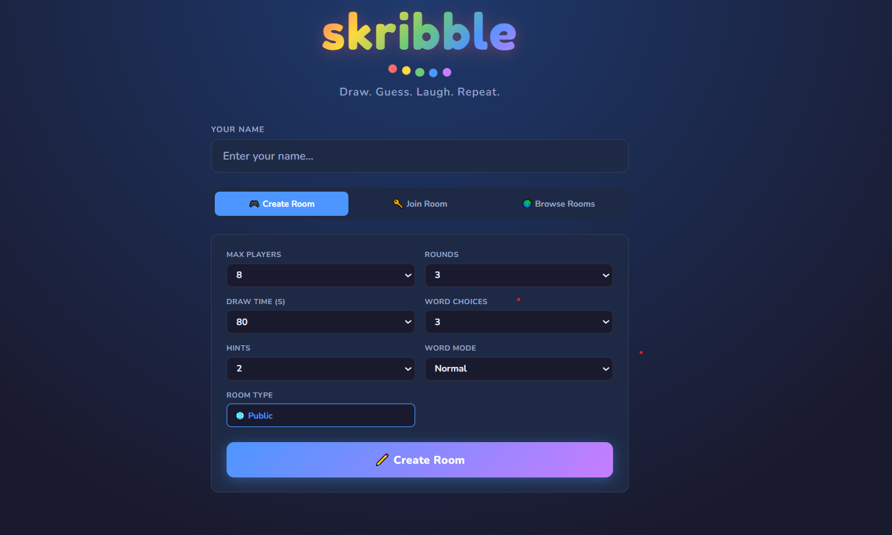
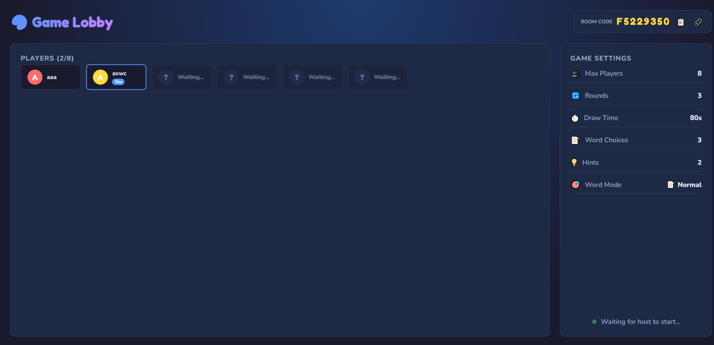
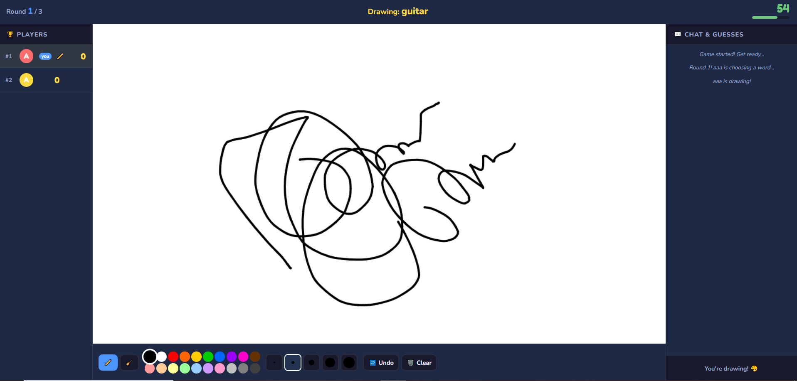
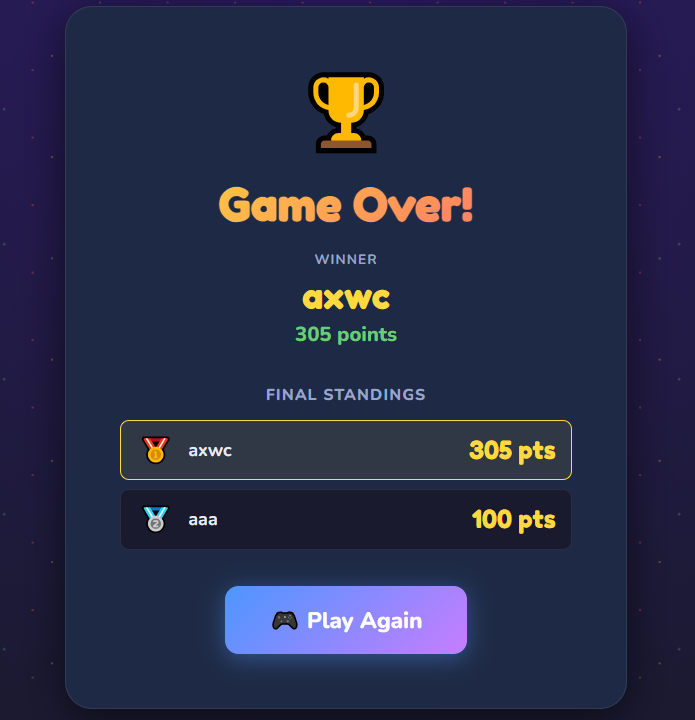

# 🎨 Skribble – Real-Time Multiplayer Draw & Guess Game
Project Description...
A full-stack multiplayer drawing and guessing game inspired by **skribbl.io**, built using **React, Node.js, Express, and Socket.IO**.

Players can create public or private rooms, draw words in real time, guess drawings, earn points, and compete on a live leaderboard. The application supports spectators, custom word lists, multiple word modes, replay functionality, moderation tools, and seamless real-time synchronization across all connected clients.

---

## 🚀 Live Demo

**Frontend:** https://scribble-clone.netlify.app/

**Backend:** https://scribble-backend-4a3i.onrender.com
 
---

## Screenshots

### Home Page

<p align="center">
  
</p>

### Lobby

<p align="center">
  
</p>

### Gameplay

<p align="center">
  
</p>

### Winner Screen

<p align="center">
  
</p>

## 📌 Features

### Core Gameplay

* Create and join multiplayer rooms
* Public and private room support
* Real-time drawing synchronization
* Turn-based drawing and guessing
* Word selection system
* Live chat and guessing
* Automatic score calculation
* Live leaderboard updates
* Winner announcement at game end

### Drawing Tools

* Brush tool
* Eraser tool
* 20 color palette
* 5 brush sizes
* Undo last stroke
* Clear canvas

### Advanced Features

* Spectator Mode
* Replay Last Round
* Custom Word Lists
* Word Categories
* Hint System
* Kick Player
* Ban Player
* Animated Round Timer

### Word Modes

#### Normal Mode

Drawer sees the complete word.

#### Hidden Mode

Drawer sees only blanks and must draw without seeing the actual word.

#### Combination Mode

Drawer sees partial hints such as:

paper boat → p___r b__t

---

## 🏗️ Architecture

```text
┌─────────────────────┐
│   React Frontend    │
└──────────┬──────────┘
           │
           │ Socket.IO
           │
┌──────────▼──────────┐
│  Express Backend    │
│   + Socket.IO       │
└──────────┬──────────┘
           │
           ▼
┌─────────────────────┐
│  Game Engine (OOP)  │
├─────────────────────┤
│ Player Class        │
│ Room Class          │
│ Game Class          │
│ MessageHandler      │
└─────────────────────┘
```

---

## 🛠️ Tech Stack

| Layer                   | Technology                |
| ----------------------- | ------------------------- |
| Frontend                | React 18 + Vite           |
| Backend                 | Node.js + Express         |
| Real-Time Communication | Socket.IO                 |
| Canvas                  | HTML5 Canvas API          |
| Styling                 | CSS3                      |
| Storage                 | In-Memory Data Structures |
| Deployment              | Render / Netlify          |

---

## 📂 Project Structure

```text
skribble/
│
├── server/
│   ├── index.js
│   ├── MessageHandler.js
│   ├── Room.js
│   ├── Game.js
│   ├── Player.js
│   └── words.js
│
├── client/
│   └── src/
│       ├── components/
│       ├── hooks/
│       ├── pages/
│       └── App.jsx
│
└── README.md
```

---

## 🎯 Object-Oriented Design

### Player Class

Responsible for:

* Player state
* Score tracking
* Serialization
* Guess status

### Room Class

Responsible for:

* Room management
* Host assignment
* Broadcasting events
* Spectator management
* Ban system
* Custom word storage

### Game Class

Responsible for:

* Round management
* Turn rotation
* Scoring logic
* Word selection
* Hint generation
* Drawing state

### MessageHandler Class

Responsible for:

* WebSocket event handling
* Client communication
* Room orchestration
* Game flow management

---

## 🎮 Gameplay Flow

```text
Create Room / Join Room
            │
            ▼
          Lobby
            │
            ▼
     Host Starts Game
            │
            ▼
     Drawer Selects Word
            │
            ▼
      Real-Time Drawing
            │
            ▼
      Players Guess
            │
            ▼
      Points Awarded
            │
            ▼
        Round Ends
            │
            ▼
      Next Drawer
            │
            ▼
        Game Over
            │
            ▼
     Winner Announced
```

---

## 🔥 Feature Checklist

### Must Have

* ✅ Create room with configurable settings
* ✅ Join room via link or code
* ✅ Lobby with player list
* ✅ Turn-based rounds
* ✅ Real-time drawing synchronization
* ✅ Word selection
* ✅ Guessing system
* ✅ Scoring and leaderboard
* ✅ Winner announcement
* ✅ Drawing tools

### Should Have

* ✅ Hints
* ✅ Chat
* ✅ Draw timer
* ✅ Private rooms

### Nice To Have

* ✅ Word categories
* ✅ Eraser tool
* ✅ Kick player
* ✅ Ban player
* ✅ Spectator mode
* ✅ Replay system
* ✅ Custom word lists
* ✅ Multiple word modes

---

## ⚡ Real-Time Features

### Drawing Synchronization

Drawing strokes are transmitted through Socket.IO events and rendered on all connected clients instantly.

### Canvas Replay

Every drawing stroke is stored and can be replayed at the end of a round.

### Late Join Synchronization

New players receive the complete stroke history and reconstruct the current canvas automatically.

### Hint System

Letters are progressively revealed during the round to help players guess the word.

---

## 📡 WebSocket Events

### Room Management

* create_room
* join_room
* join_spectator
* room_created
* room_joined
* player_joined
* player_left

### Game Events

* start_game
* game_started
* round_start
* word_options
* word_chosen
* round_end
* game_over

### Drawing Events

* draw_start
* draw_move
* draw_end
* draw_data
* canvas_clear
* canvas_cleared
* draw_undo
* canvas_undo

### Chat & Guessing

* guess
* guess_result
* chat
* chat_message

### Moderation

* kick_player
* ban_player
* kicked

---

## 🔗 REST API

| Method | Endpoint      | Description          |
| ------ | ------------- | -------------------- |
| GET    | /health       | Server health check  |
| GET    | /api/rooms    | List available rooms |
| GET    | /api/room/:id | Room information     |

---

## ⚙️ Installation

### Clone Repository

```bash
git clone https://github.com/aakash1612/Scribble-clone
cd skribble
```

### Install Dependencies

```bash
npm run install:all
```

### Configure Environment Variables

Server:

```env
PORT=3001
CLIENT_URL=http://localhost:5173
```

Client:

```env
VITE_SERVER_URL=http://localhost:3001
```

### Run Development Server

```bash
npm run dev
```

Frontend:

```text
http://localhost:5173
```

Backend:

```text
http://localhost:3001
```

---

## 🚀 Deployment

### Render

1. Push repository to GitHub
2. Create a new Render Web Service
3. Configure environment variables
4. Deploy backend
5. Deploy frontend
6. Update `VITE_SERVER_URL`

### Railway

```bash
railway init
railway up
```

### Vercel + Render

* Frontend → Vercel
* Backend → Render

> Note: Vercel Serverless Functions do not support persistent Socket.IO connections. Use Render or Railway for the WebSocket server.

---

## 🔐 Engineering Decisions

### Why Socket.IO?

Socket.IO provides:

* Low latency communication
* Automatic reconnection
* Room support
* Event-based architecture

### Why Store Strokes Instead of Images?

Benefits:

* Lower bandwidth usage
* Replay support
* Undo support
* Late join synchronization

### Why OOP Architecture?

Benefits:

* Better code organization
* Easier maintenance
* Improved scalability
* Clear separation of responsibilities

---

## 👨‍💻 Author

**Akash Varshney**

MERN Stack Developer

GitHub: https://github.com/aakash1612/EdTech_Platform

LinkedIn: https://www.linkedin.com/in/akash-varshney-5837171b5/

---

## 📜 License

This project was developed for educational and academic purposes.

---

### ⭐ Assignment Achievement

This project successfully implements all required features from the assignment specification along with several advanced enhancements, including:

* Spectator Mode
* Replay System
* Custom Word Lists
* Multiple Word Modes
* Host Moderation
* OOP Backend Architecture

The application is fully functional, real-time, multiplayer, and production-ready.
